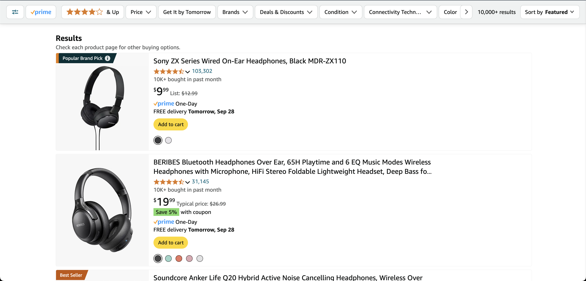

# Amazon Search Remix

Amazon Search Remix is a Tampermonkey script to re-render Amazon search results pages to make them more attractive and usable.

## Features

- Scrape product details (name, rating, # ratings, # purchases, price, delivery estimate) from Amazon's search results page
- Reconstruct and re-render the results in a cleaner design, omitting cruft
- Transform SEO-optimized keyword-heavy product names into more human-readable ones

## Technologies Used

- JavaScript
- CSS injection via Tampermonkey

## How It Works

Tampermonkey injects the code in `main.js`, which runs after an Amazon search page is loaded into the DOM. A scraping function uses CSS query selectors to extract product attributes and a separate render function uses the scraped data to reconstruct and re-render a new search results page with a different visual appearance.

## Usage

1. Load `main.js` into Tampermonkey and visit any Amazon search results page
2. Or as an alternative, paste the JS directly into the developer console, since it's self-contained
